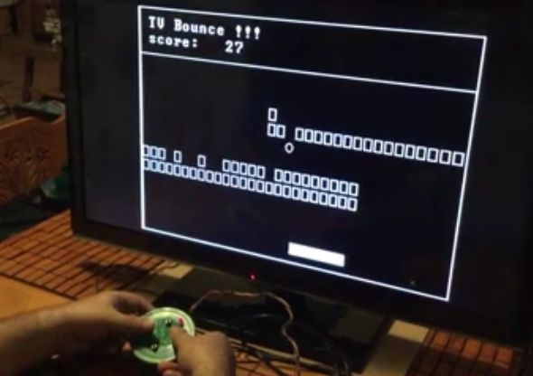

# TV-Bounce

TV Bounce, (C) Erich Glinker, July, 2017

## Intro

TV bounce is a TV Video game inspired by all of the 
ball bouncing style TV video games of the 70s.  

  This project is released undern the the GNU General 
  Public License, see:
  
      http://gnu.org/licenses/licenses.html for details.

## Circuit Description

The circuit for the TV Bounce console is centered on an ATMega328P microcontroller with a 16MHz crystal.  For the sake of simplicity, anyone who wants to reproduce this project can start by taking an Arduino Uno board and adding the components shown in the schematic below:

Note that the NTSC Video Out signal connects directly to the Analog Video In on a TV. The resistors attached to the pushbuttons are all 10K.

## How to Build and Download 
 
  To build the game binary file you need to have
  the following files, it can be compiled using avr-gcc:
 
 	main.c
 	amvtg.C
 	amvtg.h
 	vgafont.h
 
  Type the lines below to compile, link and produce the .hex binary.
 
  avr-gcc.exe -g -Os -mmcu=atmega328p -c amvtg.c     -Wall -gdwarf-2 -std=gnu99 -DF_CPU=16000000UL -Os -funsigned-char -funsigned-bitfields -fpack-struct -fshort-enums
 
  avr-gcc.exe -g -Os -mmcu=atmega328p -c main.c      -Wall -gdwarf-2 -std=gnu99 -DF_CPU=16000000UL -Os -funsigned-char -funsigned-bitfields -fpack-struct -fshort-enums
 
  avr-gcc.exe -g -mmcu=atmega328p -o demo.elf amvtg.o main.o
 
  avr-objcopy -j .text -j .data -O ihex demo.elf demo.hex 
 
  Type the lines below to upload to board using avrdude.exe
 
  avrdude.exe -C "C:\avrdude\avrdude.conf" -p atmega328p -c arduino -P COM3 -b 115200 -U   flash:w:demo.hex

 ## Credits
 
  This file uses the following sourse code from the AMVTG project - ATmega NTSC  
  Video Text Generator to generate video out, written 
  by Stian Soreng, http://jmp.no/atvideotext/
 
 
